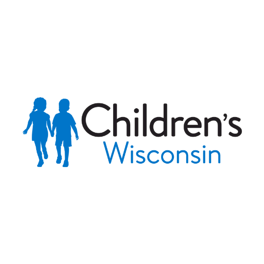
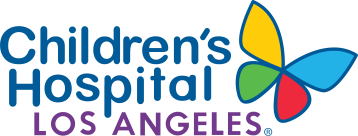
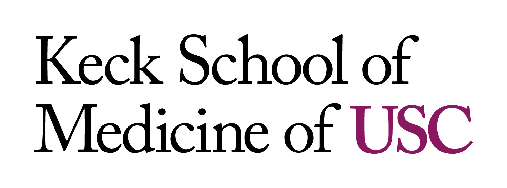
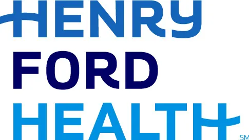

# Agentic Pathology Workshop

*A 45-minute hands-on workshop showing what an agentic workflow does that a chatbot can't.*

---

<table>
<tr>
<td align="center" width="33%">

**📘 [Open the handbook](https://hesamhakim.github.io/agentic-pathology-workshop/docs/attendee_handbook.html)**

Everything in one page —
PDFs, prompts, copy buttons

</td>
<td align="center" width="33%">

**📊 [Open the slide deck](https://hesamhakim.github.io/agentic-pathology-workshop/docs/slides/html-presentation/AI-Agentic-workflow-case-studydeck-standalone.html)**

25 slides, standalone HTML

</td>
<td align="center" width="33%">

**🖥️ [Workshop VM](https://pi-2026-workshop.javadilab.org)**

`pi-user-NNN` accounts, pre-provisioned

</td>
</tr>
</table>

---

All attendees, each with their own LangFlow account on a shared workshop VM, work through three flows in sequence. Same four PDFs go in. Three very different outputs come out. The point is the gap between them.

## What attendees do

**1 · Chatbot (warm-up, ~7 min).** Attach four AML PDFs in chat, ask for an integrated diagnostic report, get a prose reply. Different every run, no citations, prognostic variants drift into the diagnosis line. This is the "before."

**2 · Agentic workflow — Integrated Report → WHO (~25 min).** The same four PDFs feed a seven-component pipeline. Two LLM stages (extraction, then integration), plus parallel post-processing and a QA reviewer. Output: a structured 11-section integrated report, a per-sentence evidence trace mapping every claim back to a source PDF, and a QA-flag section that catches lane-discipline violations and unsupported sentences. Attendees see the two editable system prompts in the canvas; the workshop exercise is to edit one and watch the output change.

**3 · Build a workflow yourself — Research Buddy (~10 min).** A tiny five-node agentic flow from stock LangFlow components — Chat Input, Agent, Wikipedia, Calculator, Chat Output. About seven minutes to build from scratch, with the completed reference shipped in each account if anyone gets stuck. Demonstrates the agentic pattern at its smallest scale: an LLM that picks tools at runtime.

## Where to find things

| What | Where |
|---|---|
| **Attendee handbook** (everything in one HTML page — PDF links, user prompts, system prompts, copy buttons) | [Open in browser](https://hesamhakim.github.io/agentic-pathology-workshop/docs/attendee_handbook.html) · [source](docs/attendee_handbook.html) |
| **Slide deck** (25 slides, standalone HTML) | [Open in browser](https://hesamhakim.github.io/agentic-pathology-workshop/docs/slides/html-presentation/AI-Agentic-workflow-case-studydeck-standalone.html) · [source](docs/slides/html-presentation/AI-Agentic-workflow-case-studydeck-standalone.html) |
| **Per-flow READMEs** (same content, split by flow) | [`docs/workshop_materials/`](docs/workshop_materials/) |
| **The four AML PDFs** | [`data/scenario_d/case_aml/`](data/scenario_d/case_aml/) |
| **LangFlow flow JSONs** | [`langflow_flows/`](langflow_flows/) |
| **Custom component sources** | [`langflow_flows/components/`](langflow_flows/components/) |
| **Troubleshooting (for facilitators)** | [`docs/troubleshooting.md`](docs/troubleshooting.md) |

The handbook is the single thing an attendee actually needs. Open it in any browser, and every prompt is a click-to-copy away.

## Workshop infrastructure

Each attendee gets a pre-provisioned LangFlow account on `pi-2026-workshop.javadilab.org` with all six flows imported and ready: `0_general_chatbot`, `D_integrated_report_to_who`, `Research_Buddy`, plus three bonus scenarios (`A_variant_tournament`, `B_longitudinal_ghost`, `C_digital_thread_v2`) that aren't presented from stage but live on for self-exploration.

Behind the VM sits a small stack:

- **LangFlow 1.9.2** for the agent canvas and Playground UI
- **KeyBroker** — an in-house FastAPI proxy that holds the real OpenRouter key and enforces a per-attendee rate limit, so no attendee handles credentials directly
- **Arize Phoenix** ships with the stack but is currently disabled (`OTEL_SDK_DISABLED=true`) because LangFlow's own instrumentation floods it with health-check spans; the workshop's auditability story lives in the Part B evidence trace inside Scenario D's output, not in Phoenix tracing

The proxy is what makes the build-your-own exercise frictionless — attendees pick OpenAI in the Agent's Language Model dropdown, leave the API Key field blank, and the broker handles everything.

## Authors

<table>
<tr>
<td align="center" width="33%" valign="top">
  
  &nbsp;&nbsp;
  
    
  <strong><a href="https://fcd.mcw.edu/?faculty/view/name/Hesam_Hakim_Javadi/id/11092">Hesam Hakim Javadi, Ph.D.</a></strong> 
  Medical College of Wisconsin · Children's Wisconsin
    
  Workshop infrastructure, LangFlow components, slides, handbook.
</td>
<td align="center" width="33%" valign="top">
  
  &nbsp;&nbsp;
  
    
  <strong><a href="https://www.chla.org/profile/srikar-chamala-phd">Srikar Chamala, Ph.D.</a></strong> 
  Children's Hospital of Los Angeles · USC Keck School of Medicine
    
  &nbsp;
</td>
<td align="center" width="33%" valign="top">
  
    
  <strong>Omar Baba, MD</strong> 
  Henry Ford Health System
    
  AML case design, planted pedagogical features, Stage 1 and Stage 2 system prompts. See <a href="docs/Integrated_report_demo_Omar/">docs/Integrated_report_demo_Omar/</a>.
</td>
</tr>
</table>

## License

MIT — see [LICENSE](LICENSE).
