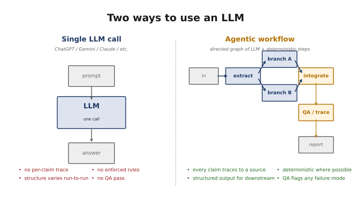
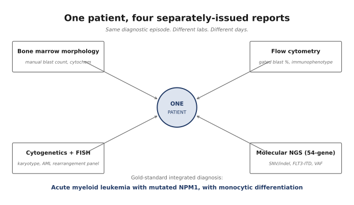
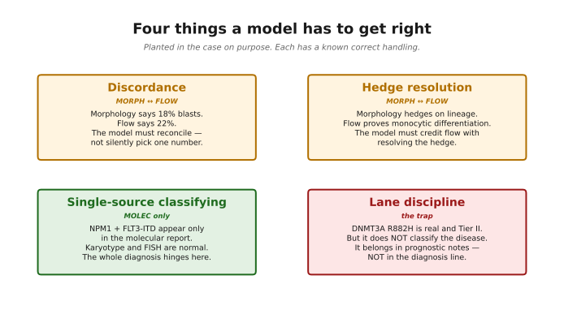
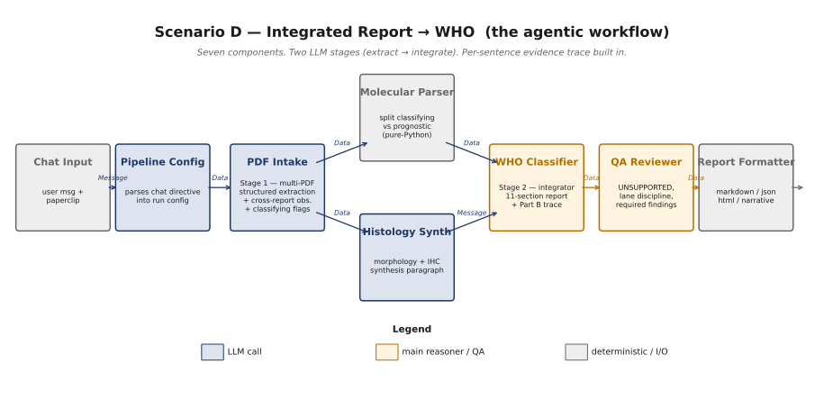
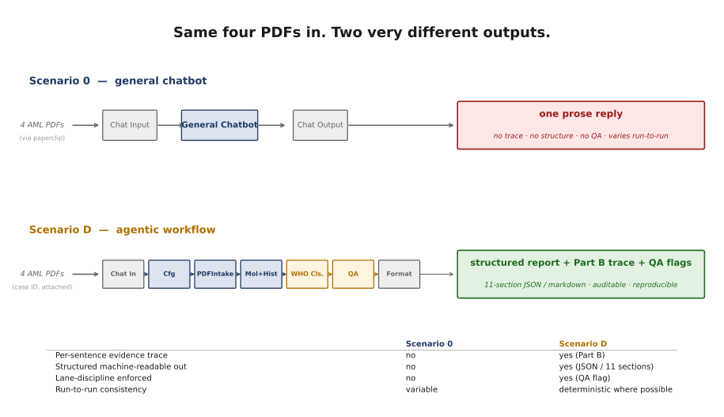

<!-- _class: lead -->

# Agentic AI for Integrated Pathology Reporting

## A workshop in two halves: one general chatbot, one purpose-built workflow

API Summit 2026 — Pathology Informatics Track
Javadi Lab

<!--
Welcome. Today is hands-on. By the end of the session every attendee
will have run the same clinical task two ways and seen, in their own
output, what workflow design buys you over prompt engineering. About
15 minutes of slides up front, then ~90 minutes hands-on across two
LangFlow workspaces, then 15 minutes of discussion.
-->

---

# What you'll do today

1. **Concept** — what makes a workflow "agentic" versus a chat (≈10 min, this deck)
2. **Hands-on Part 1** — run the integrated-reporting task with a general chatbot (≈25 min, **`0_general_chatbot`** flow)
3. **Hands-on Part 2** — run the same task with a purpose-built multi-agent workflow (≈45 min, **`D_integrated_report_to_who`** flow)
4. **Side-by-side discussion** — same input, two outputs, what's actually different (≈15 min)

Everyone is signed in at **`https://pi-2026-workshop.javadilab.org`** with their `pi-user-NNN` username and the shared password the facilitator announced.

<!--
Three deliberate design choices for this workshop: (1) start with a
chatbot so the contrast is felt, not just told; (2) use the exact
same input PDFs for both halves so the comparison is honest; (3) use
the same model (gpt-4o) in both halves so any difference is workflow
design, not model capability.
-->

---

# The shape of standard LLM use

A **single prompt** in. A **single reply** out. One call.

This is how almost every AI tool we use today is built — ChatGPT, Gemini, Claude, Copilot.

Powerful for many things. **Insufficient for some.**

<!--
The left side of the diagram is the entire architecture of every
mainstream consumer AI tool. You write something, you get something
back. The model has wide knowledge. It's helpful. For lots of tasks,
this is fine.

The point isn't that single-call use is bad. The point is that for
some tasks it's not enough — and integrated pathology reporting is
one of those tasks.
-->

---

# Where standard LLM use falls short — for clinical workflows

A signed pathology report is a clinical document. So we need to ask of any AI-assisted output:

- Can I trace **which source** supports each sentence?
- Is the **structure of the output predictable** from run to run?
- Is there a **QA pass** that catches the obvious failure modes?
- Are there rules the system **cannot violate** by accident?
- Can a **downstream LIS** ingest this as structured data?

A single LLM call gives us none of those, on purpose. They're not built into the architecture.

<!--
Read these slowly. Each one is a real question pathologists already
ask of AI output today. Attendees will see exactly these gaps in
their own Scenario 0 output in about half an hour.

The phrase that matters: "not built into the architecture." It's not
that the LLM can't do these things — sometimes it does. It's that
nothing in the workflow design *guarantees* them. That's what
agentic workflows fix.
-->

---

# Agentic workflow

A **directed graph** of LLM calls and deterministic steps. Each stage produces a structured handoff to the next.

- Some stages are LLM-driven (extract, reason, synthesize)
- Some stages are pure code (filter, route, format, check)
- A **QA / trace sidecar** is part of the topology, not an afterthought

The LLM is still doing the hard reasoning. The structure around it is what makes the output *defensible*.

<!--
Important framing point: agentic workflow is not "more AI." It's
*less* AI in any given step, and *more structure* around the
overall process.

When attendees later edit the Scenario D system prompts, they'll be
editing the LLM-driven stages. The deterministic glue between those
stages is what makes the output reproducible and auditable.

Cite Anthropic's "Building Effective Agents" paper here if asked —
workflows vs agents distinction, etc.
-->

---

# When to reach for an agentic workflow

| Task shape | Single LLM call | Agentic workflow |
|---|---|---|
| Conversational Q&A | **✓ great** | overkill |
| One-off creative writing | **✓ great** | overkill |
| High-stakes synthesis from multiple sources | risky | **✓ right tool** |
| Output must be auditable / structured | **✗ no** | **✓ yes** |
| Same task, same output expected every time | variable | **✓ deterministic where it can be** |
| Failure modes are known and avoidable | hope for the best | **✓ enforced in QA** |

Today's case study sits firmly in the bottom four rows.

<!--
This isn't a "agentic is always better" claim. For a quick "summarize
this email" the chatbot is the right tool. The interesting cases are
when the requirements list the bottom four rows — that's when you
reach for the multi-stage workflow.

Important: many production AI systems shipping today are blends.
ChatGPT itself now has agentic features (browsing, tools, memory).
The distinction is architectural, not absolute.
-->

---

# Today's case study

**Integrated pathology reporting.**

One patient, one bone marrow workup. The diagnosis depends on combining **four separately-issued reports** from different labs on different days.

The fictional patient: an adult male presenting with leukocytosis, anemia, thrombocytopenia, and 41% peripheral blasts. New bone marrow workup.

The diagnostician's job: combine what each report contributes — and identify what only **one** of them can see.

<!--
The case is fictional, but the workflow pattern is real. Modern
oncologic diagnosis often depends on integrating morphology, flow,
cytogenetics, and molecular results — these can come back over
days or weeks. Someone has to synthesize them.

This case is courtesy of Omar — pathologist-authored, with planted
pedagogical features. Credit him.
-->

---

# The four component reports

| Source | Modality | What it carries decisively |
|---|---|---|
| `01_…_morphology.pdf` | Bone marrow morphology | Manual blast count, cytochemistry, hedge on lineage |
| `02_…_flow.pdf` | Flow cytometry | Gated blast %, immunophenotype, lineage resolution |
| `03_…_cyto_fish.pdf` | Cytogenetics + FISH | Karyotype, AML rearrangement panel (here: **normal**) |
| `04_…_molecular.pdf` | Molecular NGS (54-gene) | SNV/indel, FLT3-ITD, VAF, prognostic variants |

All four PDFs are in `data/scenario_d/case_aml/` in the workshop repo. Download them to your laptop before Part 1.

<!--
Pause here so attendees can find the PDFs. The facilitator should
have them on a USB drive as backup.

Note the cytogenetics line — it's normal. That's the central point
of the case. Everything that classifies the disease is sitting in
the molecular report alone.
-->

---

# Four things a model has to get right

<!--
These four features are planted in the case deliberately. Each has a
known correct handling. When attendees compare the chatbot output to
the Scenario D output in Part 3, these four features are exactly
what they'll grade against.

Discordance: blast count. Morphology and flow give different numbers
because they're different methods. A model that picks one silently
has missed the methodological lesson.

Hedge resolution: morphology hedged on lineage. Flow proved monocytic.
A good output credits flow with resolving the question — doesn't
treat the reports as contradictory.

Single-source classifying: NPM1 and FLT3-ITD only appear in the
molecular report. Cytogenetics is completely normal. This is the
whole argument for integrated reporting in one example.

Lane discipline trap: DNMT3A R882H is real, Tier II, prognostically
relevant — but it does NOT classify the disease. A model that writes
it into the diagnosis line has failed the test. It belongs in the
molecular summary and prognostic notes, not the diagnosis.
-->

---

<!-- _class: lead -->

# Part 1

## Try it as a general chatbot

≈25 minutes hands-on  ·  flow: **`0_general_chatbot`**

<!--
Now we shift from concept to hands-on. Attendees open Scenario 0,
attach the four PDFs, and chat with it.

Tell attendees: don't refine the chatbot prompt yet. First just see
what the model produces with a simple "give me an integrated
diagnostic report" instruction. We'll discuss what's missing before
moving to Scenario D.
-->

---

# Scenario 0 — the flow

Three nodes on the canvas. **Chat Input** → **General Chatbot** → **Chat Output**. The General Chatbot has one editable thing: its system prompt. That prompt is the entire "workflow."

In Playground, attach all four AML PDFs via the **paperclip icon** in the chat box. Type your question. Press send.

<!--
If the screenshot isn't dropped in yet, this slide will show a
broken-image placeholder. The screenshot specs are in
docs/slides/README.md.

When narrating: the canvas itself is deliberately minimal. There's
nothing to break. Attendees should treat this like ChatGPT — just
chat.
-->

---

# What to do in Part 1

A starter prompt:

> *"Produce an integrated diagnostic report for this patient using all four reports."*

Then, with the response in front of you, ask:

- How do I know which source supports each sentence?
- Is the **DNMT3A R882H** finding placed in the diagnosis line or the prognostic notes?
- If I run this prompt a **second time**, how much does the structure of the answer change?
- If a downstream lab system needed this as **JSON**, what would it parse?

These four questions are the entire point of Part 1. **Write down your answers** — we'll come back to them.

<!--
Encourage attendees to actually run the same prompt twice and compare
the two outputs. Variability is the most visceral demonstration that
this architecture doesn't constrain the output structure.

If someone gets a "perfect" answer on the first try, ask them: how
would you know it was perfect without already knowing the answer?
That's the auditability question.
-->

---

<!-- _class: lead -->

# Part 2

## Use the agentic workflow

≈45 minutes hands-on  ·  flow: **`D_integrated_report_to_who`**

<!--
Transition. Tell attendees: the same model. Same four PDFs. Same
clinical question. The only difference is how we structure the work
we ask the model to do.
-->

---

# Scenario D — the architecture

<!--
Walk left to right. Two LLM stages: Stage 1 is multi-PDF
extraction; Stage 2 is integration. Between them sits a
deterministic split (Molecular Parser) and a parallel-branch
LLM step (Histology Synthesizer). At the end, a QA Reviewer
checks for known failure modes, and a Report Formatter
turns the structured output into markdown / JSON / HTML.

The key idea: every box has a single responsibility. None of them
needs to do everything that the General Chatbot does in one shot.
That's the source of the structural guarantees.
-->

---

# Stage 1 — PDF Intake (the extractor)

The headline custom component. **One LLM call**, edits the entire downstream behavior.

Reads all four PDFs together, emits a single structured JSON containing:

- **Per-source `key_findings`**, each tagged with `source_id` (`MORPH`/`FLOW`/`CYTO`/`MOLEC`) and a `verbatim_support` phrase copied from that source
- **`cross_report_observations`**: concordances · discordances (with resolution + basis) · single-source findings
- **`classifying` boolean** on every variant — distinguishes disease-defining from prognostic-only

Edit this prompt and every downstream stage changes.

<!--
This is THE editable lever for the case. The Stage 1 prompt is
verbatim Omar's design. If attendees want to experiment, this is
where to start — change how the extractor handles a discordance,
change the classifying rule, change the schema. Watch the cascade.

verbatim_support is the trust anchor. Every finding the extractor
emits has a copied-from-source phrase attached. That's what makes
the eventual evidence trace check-able.
-->

---

# Stage 2 — WHO Classifier (the integrator)

The integration LLM call. Same model class as Scenario 0's chatbot. **Two new things:**

- It only sees the **structured JSON** the extractor produced (not the raw PDFs again). The data has been organized.
- Its prompt enforces **explicit rules**: address every discordance; name every single-source finding; keep non-classifying variants out of the diagnosis line.

Output: an **11-section structured report** plus a **Part B evidence trace** mapping every interpretation and diagnosis sentence to its source.

If a sentence can't be traced, the trace row is marked `UNSUPPORTED` — and the QA reviewer downstream flags it as a pipeline failure.

<!--
Worth emphasizing: this is still a single LLM call, just like
Scenario 0. The model is doing the reasoning. The reason the output
is so different is what came BEFORE this stage: pre-organized,
source-tagged structured data.

The "11 sections" matter for downstream LIS ingestion. Same shape
every run. Each section is named the same way. JSON is parseable.
-->

---

# Scenario D — the LangFlow canvas

The same architecture you just saw — in the actual UI you'll edit. Seven boxes on the canvas, plus chat I/O.

In Playground, type **`run the aml case`** and press send. The Pipeline Config parses your directive; the rest of the flow handles the four PDFs automatically from the case manifest.

<!--
For the workshop: attendees don't need to attach files in Scenario D.
The case manifest already knows which PDFs belong to the AML case.
They just type the case directive.

If the screenshot isn't dropped in yet, this slide will show a
placeholder. The screenshot specs are in docs/slides/README.md.
-->

---

# Scenario D — what the output looks like

Eleven structured sections (patient · component studies · clinical context · per-modality summaries · **integrated interpretation** · **final integrated diagnosis** · prognostic notes · limitations).

Plus a **Part B evidence trace**: one row per sentence in the interpretation and diagnosis, mapping it to its source(s) and the basis (`direct_finding` · `concordance` · `discordance_resolution` · `single_source_finding` · `classification_rule`).

Plus **QA flags** that catch lane-discipline failures, missing required findings, and any sentence the integrator wrote that the extraction didn't actually support.

<!--
This screenshot is the headline visual. If the audience takes one
image away, this is the one — same input as Scenario 0, completely
different output shape.

If the trace table is wide, two-screenshot variants are documented
in the README.
-->

---

# Same four PDFs in. Two very different outputs.

<!--
The big-picture comparison. Walk through the table row by row.

Per-sentence evidence trace: Scenario 0 produces prose. Scenario D
produces a sentence-numbered trace table. You can spot-check it.

Structured machine-readable: chatbot output is markdown or natural
language. Agentic output is also JSON, also parseable by a LIS
without re-running the LLM.

Lane discipline: the chatbot might happen to keep DNMT3A out of the
diagnosis line. The agentic workflow is built so it can't put it
there — the integrator's prompt forbids it, AND the QA reviewer
checks deterministically.

Run-to-run consistency: chatbot output varies in section ordering,
emphasis, wording. Agentic output has 11 sections always in the
same order — because pure-Python ReportFormatter renders them.
-->

---

# What the agentic design actually buys

A summary, with attendee output in hand:

1. **Auditability.** Every clinical claim traces to a source PDF and a verbatim phrase. The pathologist can spot-check the few sentences that matter rather than re-deriving the whole report.
2. **Structured output.** The eleven-section schema lands in a LIS without an additional LLM pass.
3. **Lane discipline guaranteed.** The integrator can't put a non-classifying variant in the diagnosis line — and if a prompt edit accidentally lets it through, the QA reviewer flags it.
4. **Reproducible structure.** Same input, same section layout, same trace table shape, every run.
5. **Single editable lever per concern.** Want different extraction rules? Edit the Stage 1 prompt. Different report format? Edit the Report Formatter. Concerns don't tangle.

<!--
This is the slide to spend time on. Attendees just produced two
outputs themselves. These five claims are now testable against their
own results.

If anyone disagrees with one of these, that's the discussion. The
deck is honest — none of these guarantees are absolute. The Stage 1
prompt is editable, which means a careless edit could break the
classifying flag logic. But the architecture makes the failure
visible (via QA flag) rather than silent.
-->

---

# Where this pattern generalizes

The integrated-reporting case is one instance of a broader class:

> Any task where you need **multi-source synthesis with auditability**.

- Tumor board prep: clinical notes + imaging report + path + molec
- Variant interpretation: ACMG criteria across population + functional + clinical
- Trial eligibility: chart review across structured + unstructured EHR data
- Chart-vs-claim reconciliation: insurance auth review
- Multi-document policy review in regulatory work

The architectural shape — **structured extraction → reasoning over the structure → traceable output** — is the same.

<!--
This is the take-home. Pathology informatics is the domain we picked
for the workshop, but the architectural lesson is broader. Whenever
you're stitching evidence from multiple sources and the output is
going to be defended, this pattern applies.

Don't oversell it. Many tasks don't need this — single LLM call is
the right tool. The question is whether the auditability matters.
-->

---

<!-- _class: lead -->

# Questions, then back to the canvas

Handbook: [`docs/attendee_handbook.md`](https://github.com/hesamhakim/agentic-pathology-workshop/blob/main/docs/attendee_handbook.md)
Repo: github.com/hesamhakim/agentic-pathology-workshop

*Credit: AML case design + planted features by Omar.
Workshop infrastructure: LangFlow 1.9 · OpenRouter · Phoenix · KeyBroker proxy.*

<!--
Final slide. Open up for questions. Then everyone goes back to their
canvases for the side-by-side discussion phase.

Quick discussion prompts if needed:
- "What would you change about Scenario D's extractor prompt to make
  the workflow handle YOUR case?"
- "Where would you NOT use this architecture? What's the right tool
  for those cases?"
- "If a vendor sold you a black-box integrated-reporting AI, what
  would you ask them to demonstrate?"
-->
